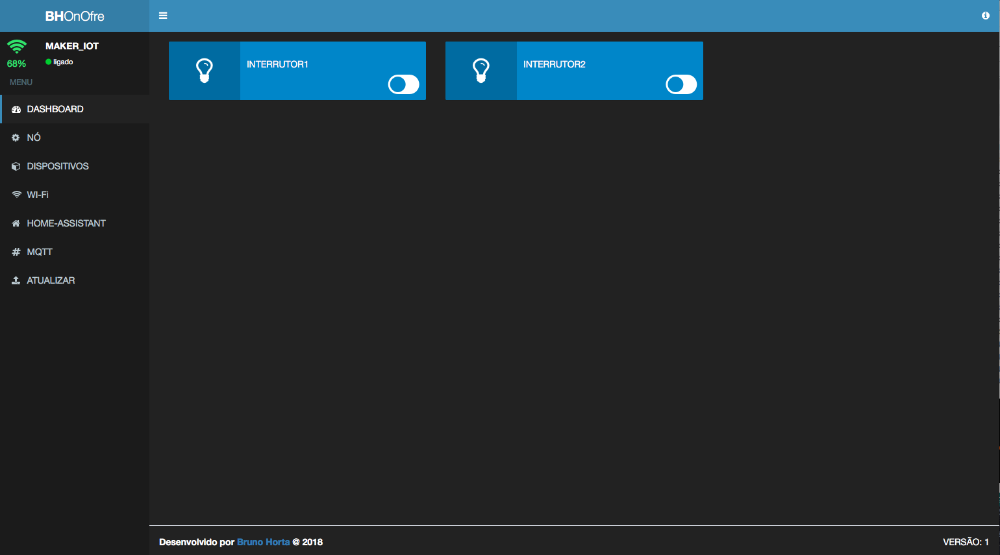
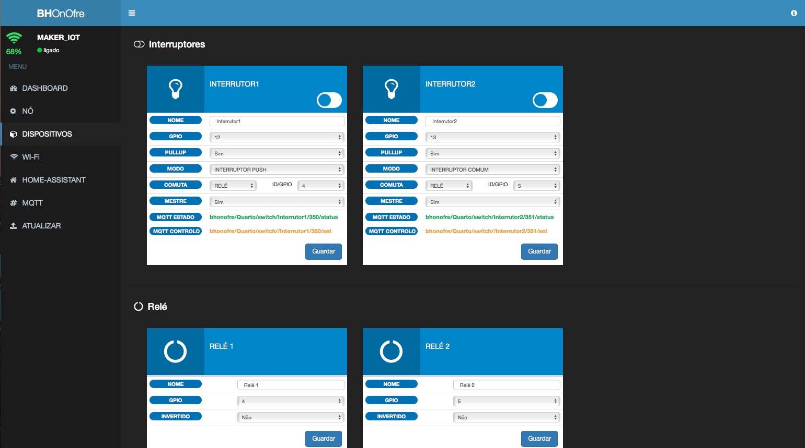
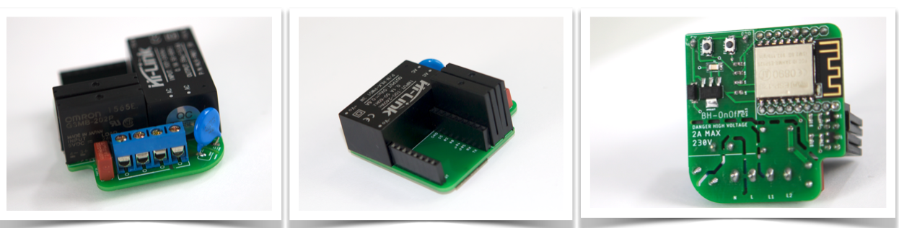

# BH OnOfre

**Conteúdo **   
* [Intro](#id1)
* [Hardware](#id2)
** [Easy Light](https://github.com/brunohorta82/BH_OnOfre/tree/master/OnOfre%20EasyLight)
* [Software](#id3)
* [Donativos](#id6)

## Intro 
O projeto BH OnOfre, é uma solução IoT baseada em ESP8266 com o objetivo de tornar a automação domiciliar muito mais simples, de forma aberta e sem restrições. Todo o código fonte é aberto bem como Hardware.

**BH OnOfre Easy Light** é um dispositivo baseado em ESP8266 com 2 relés de estado sólido cada um de 2A, este permite controlar até 2 circuitos de iluminação independentes. O facto de possuir relés de estado sólido permite ligar e desligar luzes de forma silênciosa.
O OnOfre pode ser instalado atrás dos interruptores normais, possui conectores para ligar o interruptor normal, ou sensor touch. Para alem dos conectores dedicados, permite ainda ligar os mais diversos sensores/atuadores aos GPIO's disponiveis. 
O controlo do mesmo pode ser efectuado via Web, MQTT ou manualmente pelo interruptor, tem integração automatica com o Home Assistant.
Mais info em [Easy Light REPO](https://github.com/brunohorta82/BH_OnOfre/tree/master/OnOfre%20EasyLight)

## Painel de Controlo 

## Hardware 

## Software necessário 

- Arduino Ide (caso seja para alterar o codigo fonte)
- Upload do Firmware para o ESP8266 (dentro de cada projeto o firmware está dentro da pasta binarios)
- Aceder ao AP `SSID:BH_ONFFRE_NODE_ID` e configurar a Rede Wi-Fi
- Navegar até  `http://<bh-onofre name>.local` ou `http://<bh-onofre IP address>` ou `http://192.168.4.1` ligado directamente ao módulo
- Configurar o `Wi-Fi broker`, `MQTT broker` entre outras coisas como integração automática com `Home Assistant`
- E tá feito, agora é só curtir :) 

## Donativos 

Se gostas-te do projeto podes fazer o teu donativo :).

